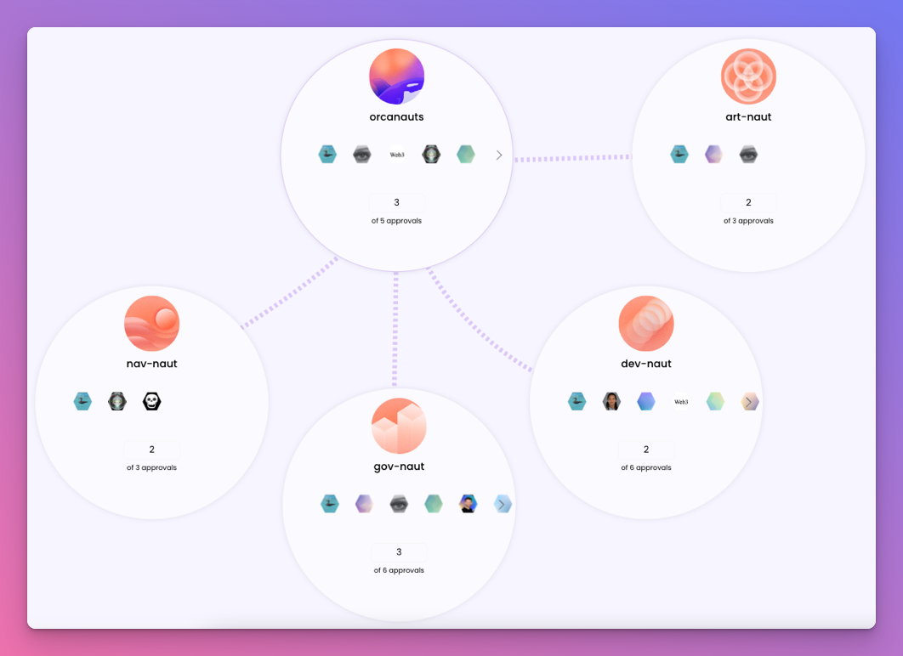

## Podarchy UI Updates
Today we released some new UI updates to our [podarchy view](https://pod.xyz/podarchy/orcanauts).

<!--truncate-->

Orca Pods make it easy to map your DAO’s architecture through our Podarchy UI. Podarchies visualize the various relationships between each group within a DAO, including membership and privileges.

Transparency is the first step towards accountability.

## Fixes and improvements

- Pod NFTs were stretching based on user lists in non-member view
- User bio card Twitter follower count bug