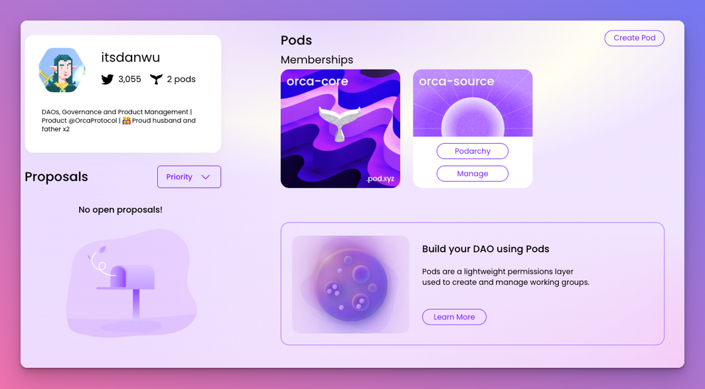

## Home Page Revamp
Our web app continues to get a facelift. We recently updated our home page to improve visibility of the pods you are apart of. 

<!--truncate-->

We also reduced the amount of clicks it requires to manage a specific pod - you can now hover over the pod cards and access the Podarchy view or manage form directly.

## Fixes and improvements

- New SDK function to create multiple pods at once
- Buttons within our Manage flow were previously getting cut off
- Bug where mobile footer was rendering in desktop view
- The rejection button for member pod proposals was not displaying after the approval threshold was reached
- Bug in filter for our proposal lists