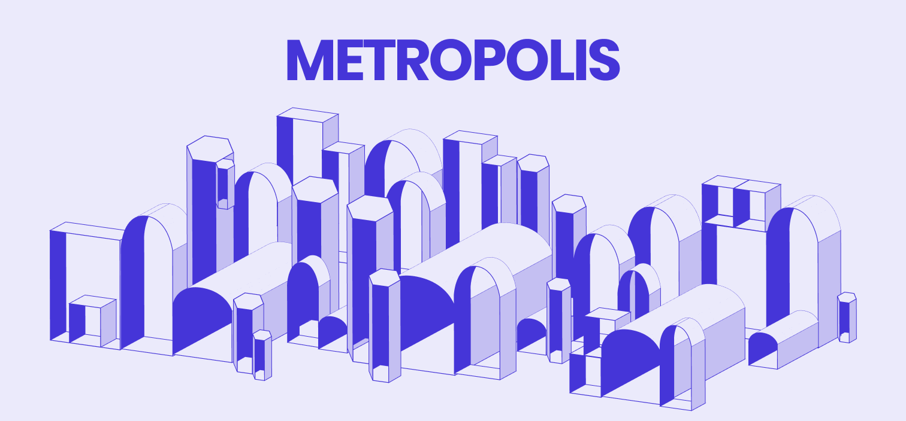
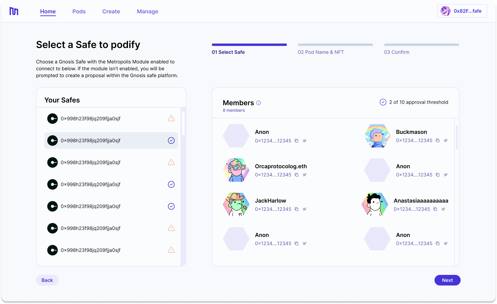
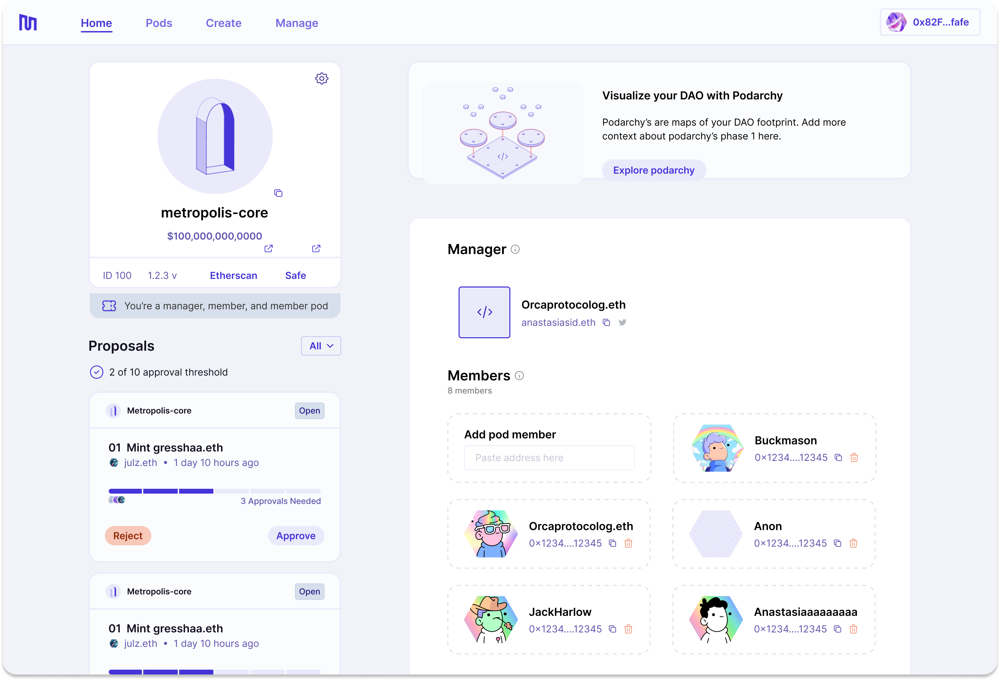

# Orca Protocol is now Metropolis!
We’re excited to share that Orca Protocol is rebranding to Metropolis and opening up our beta to a select group of DAO operators, builders, and experimenters.

<!--truncate-->

Please read our [rebrand and airdrop announcement](https://blog.metropolis.info) for all of the details on our new narrative and direction.

With this rebrand, we are also releasing a few major updates to our product:

## Podify Safe flow

At Metropolis, we are intently focused on ensuring signers of existing multi-sigs have the smoothest experience possible when supercharging their Safe with Metropolis.

From within our UI, existing signers can now easily create a Gnosis Safe transaction to enable the Metropolis module. Once that transaction is approved and executed by necessary signers, users can proceed from within our app to assign an ENS name and NFT image for their to-be-podified Safe! 

## Improved membership management

DAO operators can now add and remove members from their multi-sigs directly from our new and improved pod page.

With this update, operators can also batch all additions and removals that are planned for a given multi-sig - ensuring major transition events (e.g., steward elections and changeover) are conducted as efficiently as possible.

## Fixes and improvements

- Added Coinbase Wallet to RainbowKit
- Various performance improvements across the app 
- Fixed a client-side error that was occuring when transferring manager role
- NFT images were showing twice for pod pages on mobile non-member view