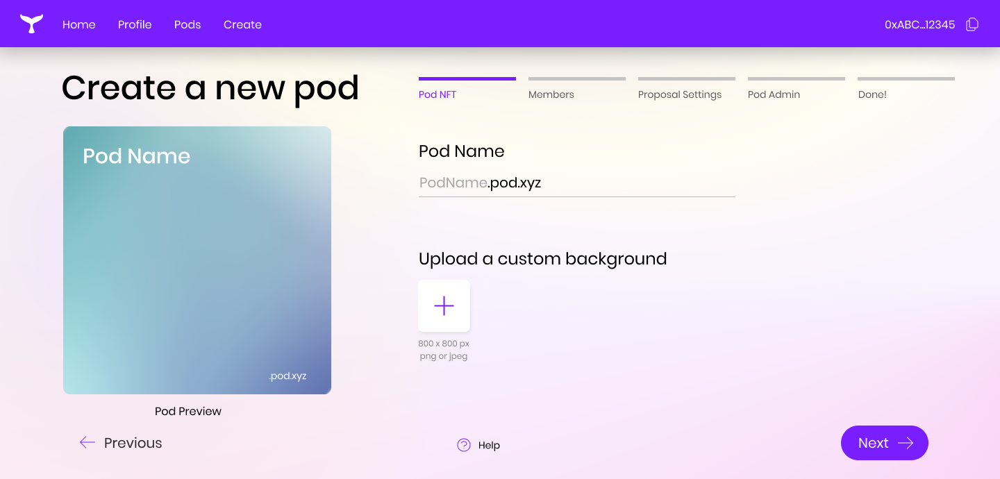
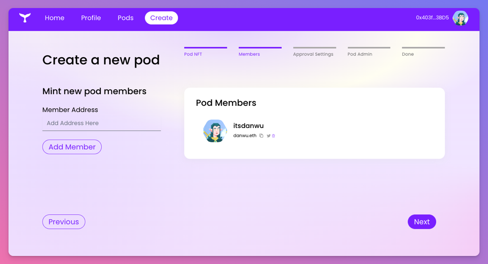
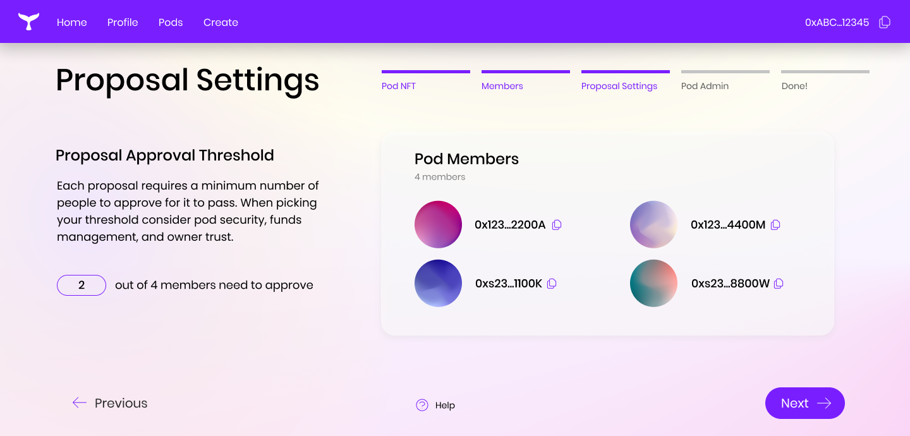
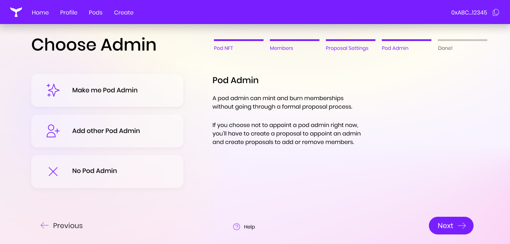
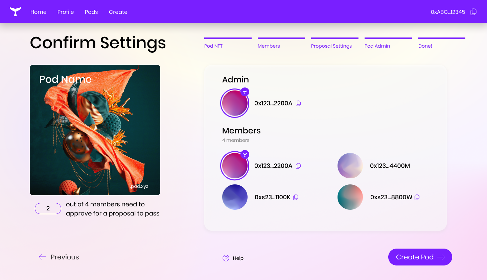
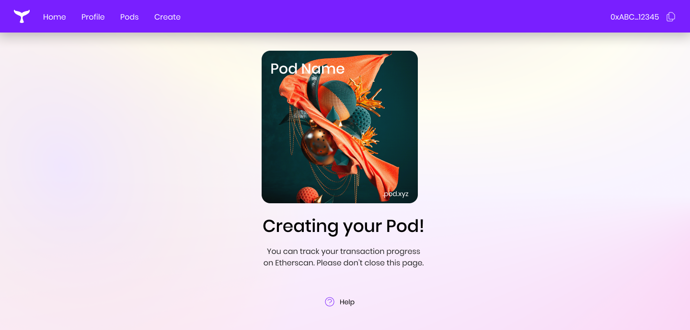

##### How to create an Orca Protocol pod.

Creating a pod is simple and can be done through the Orca web app.

## 1. Navigate to Orca app

You can access the Orca web app at https://pod.xyz/.

## 2. Pod Name and NFT Image
Once logged in to the app, click the "Create" button on the top nav bar to enter the Create Pod flow.

The first step is to set a pod name and set the NFT image for your pod. The pod name will be appended with .pod.xyz (i.e., myPod.pod.xyz) which will become the publicly accessible ENS domain for your pod.

Your NFT image should have a 1:1 ratio and 800x800px max. This NFT image is the visual representation of your pod membership. 

## 3. Add Pod Members
The next step is to add pod members to your pod. Simply copy and paste the wallet addresses of the users or other pods that you would like to be members of your new pod.

## 4. Proposal Settings
After your pod members have been selected, you need to set the approval threshold for all proposals. 
See our use cases to understand what types of proposals can be created by a pod member.

## 5. Choose an Admin
Choose an admin for your pod. You can either choose yourself, another wallet address or not set a pod admin.
See here for more information on pod roles admin responsibilities.

## 6. Confirm Settings
Confirm your pod name, NFT image, proposal settings, and admin/member selections before creating your pod!

## 7. Create!
Once your pod is created, you can navigate to your pod page to view and manage member details, access pending and executed proposals and more. 

