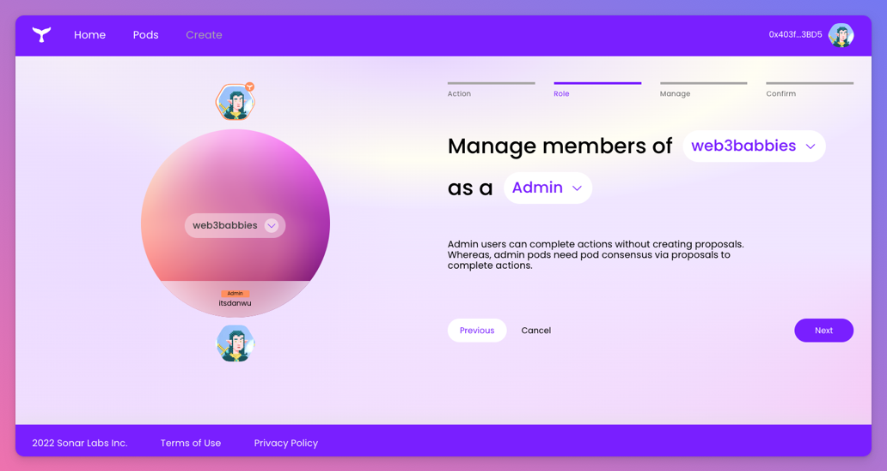
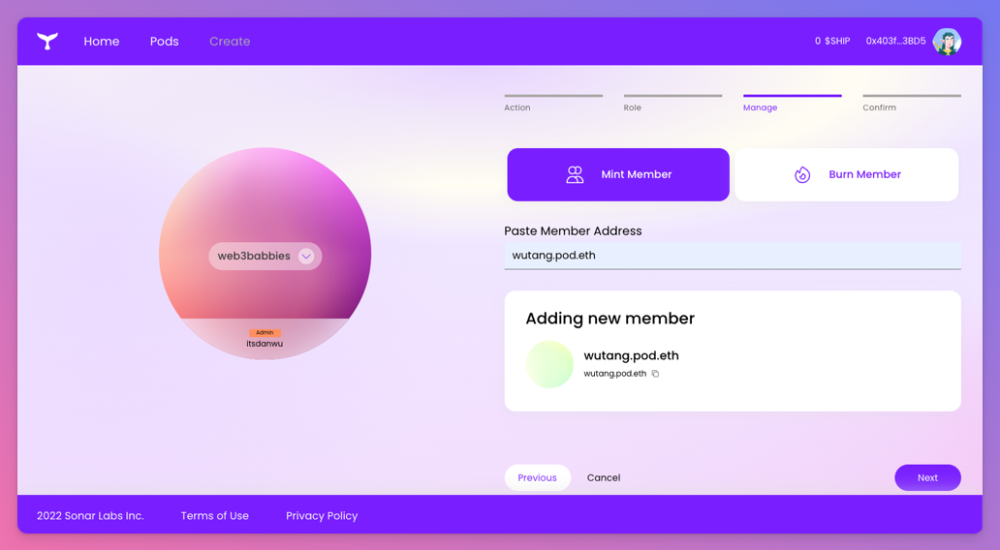
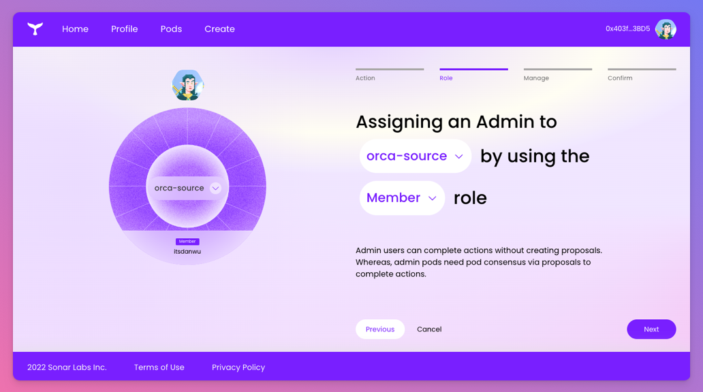
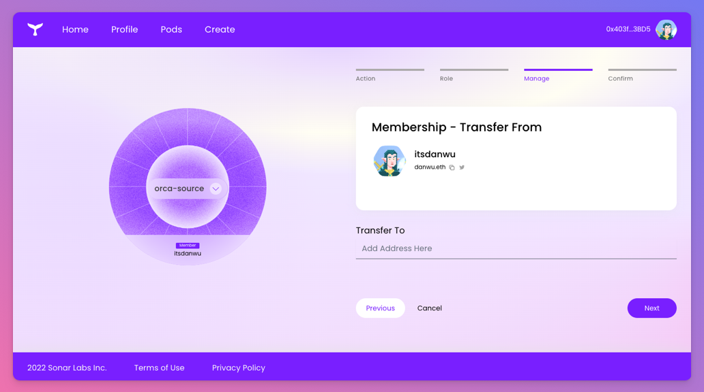

##### How to manage memberships for your pod.
---

There are a few ways in which membership can be managed for a pod:

* Add/remove members
* Adding a new pod manager
* Transferring membership/pod manager key

## Selecting your pod and role
From any pod page, access the Manage form and select the action (e.g., "Manage members", "Transfer membership or manager key") you want to take.

It's possible that you may hold multiple [roles](/docs/pod-basics/pod-roles-and-memberhsip#pod-roles) for a given pod. For example, you may be a manager AND a member of a pod.

If you choose to act as a manager, your actions not require pod approval.

## Adding and removing members
You can choose to add or remove members from your pod. If you are a member of the pod or a member pod, this flow will result in a proposal submitted to the pod for approval. If you are a manager, you will have the rights to add or remove a member directly.

Members can be actual end users or other pods. 

## Adding a pod manager
You can add a manager to your pod if one has not been set yet. This flow will result in a proposal being submitted to the pod for new pod manager approval. Managers cannot add managers - only transfer their manager keys.

Managers can be actual end users, other pods or smart contracts. 

## Transferring membership / pod manager key
You can transfer your membership or pod manager key by navigating to other users or pods. These transactions do not require pod approval.

